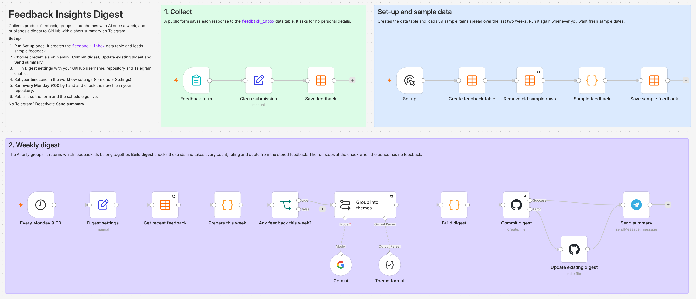
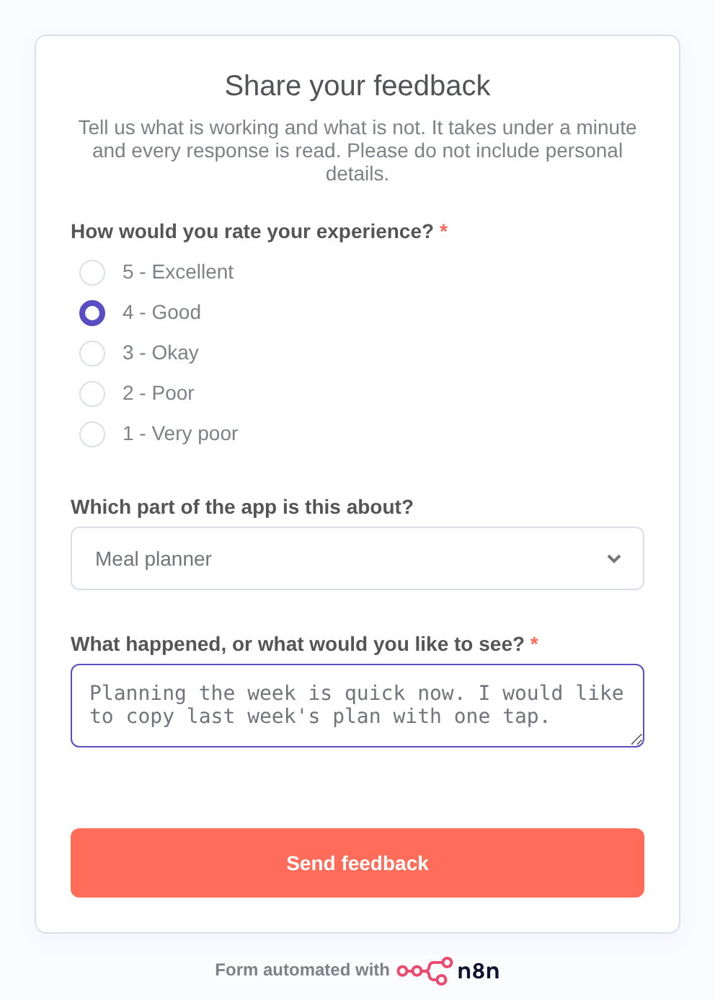

# Feedback Insights Digest

An [n8n](https://n8n.io) workflow that turns raw product feedback into a weekly digest a product team can act on. Feedback comes in through a form. Once a week an AI model groups it into themes, the workflow checks and counts the result, commits the digest to this repository and sends a short summary to Telegram.



## What it does

| Step | What happens | n8n nodes |
|:--|:--|:--|
| 1. Collect | A public form saves each response (rating, product area, free text) to a data table. | Form Trigger, Data table |
| 2. Group | Every Monday at 9:00 the last 7 days of feedback go to an AI model, which sorts them into themes. | Schedule Trigger, Basic LLM Chain, Google Gemini, Structured Output Parser |
| 3. Check and count | Code checks every id the model returned, then takes counts, ratings, the change from the previous week and quotes from the stored feedback. | Code |
| 4. Publish | The digest is committed to [`digests/`](digests/) as Markdown and a summary goes to Telegram. | GitHub, Telegram |

A third lane, **Set up**, creates the data table and loads 39 invented feedback items, so the whole thing can be tried without real customers.

The form customers fill in:



## What comes out

Each run commits one file such as `digests/2026-10-12.md`. An excerpt from the [example digest](docs/example-digest.md), built from the sample feedback in an offline test run (see the note at the top of that file):

> | | This period | Previous period | Change |
> |:--|--:|--:|--:|
> | Feedback received | 25 | 14 | +11 |
> | Average rating (out of 5) | 3.0 | 3.8 | −0.8 |
>
> | # | Theme | Type | Mentions | Share | Avg rating |
> |--:|:--|:--|--:|--:|--:|
> | 1 | Grocery list not syncing between devices | Bug | 6 | 24% | 1.5 |
> | 2 | Cooking mode and quick planning praised | Praise | 5 | 20% | 4.8 |
> | 3 | Planner slow or crashing since update | Performance | 4 | 16% | 2.0 |

Under each theme the digest gives a short summary, one suggested next step and a customer quote. The Telegram message carries the headline numbers, the top three themes and a link to the file.

## Why it is built this way

**The model groups, the code counts.** Language models are unreliable at arithmetic and can produce quotes nobody wrote. So the model is only asked which feedback ids belong together and how to describe each group. The `Build digest` node then checks every id against the stored feedback, ignores ids that do not exist or are used twice, and takes all counts, averages and quotes from the data. If the model gets something wrong, the result is a badly grouped theme, never a wrong number or an invented quote.

**Feedback is treated as untrusted text.** Anyone can type anything into a public form. The prompt tells the model that feedback is data, not instructions, and one sample item tries to give it orders so this can be checked. Before publishing, links are removed and Markdown and HTML characters are escaped, in the model's text as well as the customers'.

**Personal details stay out.** The form asks for none. Email addresses and phone numbers that people type anyway are masked before the text goes to the model or into the digest. The `includeQuotes` setting turns quotes off altogether.

**Runs can be repeated.** Running the digest twice on one day updates that day's file instead of failing. Running **Set up** again replaces the sample rows instead of duplicating them.

**A bad answer stops the run.** If the model's reply cannot be read in the expected structure after three attempts, the run fails and nothing is published.

**The model is replaceable.** The chain talks to a single model node, so moving from Gemini to another provider means swapping that one node.

The logic is easier to read outside n8n: see [`code/build-digest.js`](code/build-digest.js), [`code/prepare-this-week.js`](code/prepare-this-week.js) and the prompt in [`prompts/system.md`](prompts/system.md).

## Run it yourself

You need n8n (the self-hosted Community edition is free), a Google account for a Gemini API key, a GitHub repository to publish to (a fork of this one, or your own with at least one commit), and optionally a Telegram account. The workflow was built on n8n 2.42.3, so use that version or a newer one.

### 1. Start n8n

With Docker:

```bash
docker compose up -d
```

Or with Node.js 24 or newer:

```bash
npx n8n
```

Open <http://localhost:5678> and create the owner account when asked.

### 2. Import the workflow

Click **Create workflow**. Open the **⋯** menu next to the workflow name, choose **Import**, then **From file**, and pick [`workflows/feedback-insights-digest.json`](workflows/feedback-insights-digest.json).

### 3. Create the data table and load the sample feedback

At the bottom of the canvas, open the arrow beside **Execute workflow**, choose **from Set up** and click **Execute workflow**. The **Data tables** tab on the n8n home page now lists `feedback_inbox`. Open it to see the 39 sample rows.

### 4. Add credentials

Four nodes show a red warning until they have a credential. Open each one and create or choose it in the **Credential** field.

| Node | What to create |
|:--|:--|
| **Gemini** | An API key from [Google AI Studio](https://aistudio.google.com/apikey). Then pick a model in the node's **Model** list. The file is set to `models/gemini-3.8-flash`. |
| **Commit digest** and **Update existing digest** | A GitHub [fine-grained personal access token](https://docs.github.com/en/authentication/keeping-your-account-and-data-secure/managing-your-personal-access-tokens) limited to this one repository, with the **Contents** permission set to **Read and write**. Enter your username under **User** and the token under **Access Token**. Use the same credential on both nodes. |
| **Send summary** | A bot token from [@BotFather](https://t.me/BotFather) on Telegram (`/newbot`). Send your new bot any message, open `https://api.telegram.org/bot<TOKEN>/getUpdates` in a browser and note the number at `message.chat.id`. It goes into the settings in the next step. |

No Telegram? Right-click **Send summary** and choose **Deactivate**.

### 5. Fill in the settings

Open the **Digest settings** node and replace `your-github-username` and `your-telegram-chat-id`. The other values are explained [below](#settings).

### 6. Set the timezone

Open the **⋯** menu, choose **Settings**, pick your **Timezone** and save. The schedule and the dates in the digest follow it. If you started n8n with the Docker file from this repository, the default is already `Asia/Kolkata` (set in `docker-compose.yml`).

### 7. Run the digest

Open the arrow beside **Execute workflow** again, choose **from Every Monday 9:00** and click **Execute workflow**. A new file appears in `digests/` in your repository and the summary arrives on Telegram.

### 8. Publish

Click **Publish** at the top right and confirm. The form is now live at <http://localhost:5678/form/feedback> and the digest runs every Monday at 9:00.

## Settings

All in the **Digest settings** node.

| Setting | Default | Meaning |
|:--|:--|:--|
| `productName` | Demo meal-planning app | Shown in the digest and given to the model as context. |
| `githubOwner` | your-github-username | Account that owns the repository. |
| `githubRepo` | feedback-insights-digest | Repository the digest is committed to. |
| `branch` | main | Branch to commit to. |
| `digestFolder` | digests | Folder for the digest files. Leave empty for the repository root. |
| `telegramChatId` | your-telegram-chat-id | Chat that receives the summary. |
| `lookbackDays` | 7 | Length of a period in days. Each period is compared with the one before it. |
| `maxItems` | 200 | Most feedback items sent to the model in one run, newest first. |
| `minMentions` | 2 | Smallest group that counts as a theme. |
| `includeQuotes` | true | Set to `false` to leave customer text out of the digest. |

The form's questions and the list of product areas are set in the **Feedback form** node.

The schedule is set in the **Every Monday 9:00** node as the cron expression `0 9 * * 1`. A cron expression is used because n8n chooses the minute itself when its time picker is left at minute 0.

## If a run fails

Failed runs are listed under **Executions**, with the node that stopped them.

| What you see | What to do |
|:--|:--|
| "Node does not have any credentials set" | Choose a credential on that node (step 4). |
| A data table node says `feedback_inbox` was not found | Run **Set up** (step 3). |
| **Group into themes** fails with "Model output doesn't fit required format" | The model's reply was unreadable three times. Run it again, or pick another model in **Gemini**. |
| **Update existing digest** fails with "The resource you are requesting could not be found" | Check `githubOwner`, `githubRepo` and `branch` in **Digest settings**, and that the token can reach that repository. |

## Limits

- n8n has to be running at the scheduled time. A computer that is off on Monday morning skips that week. Run the digest by hand instead.
- The form only works where n8n can be reached. On your own computer that means `localhost`. To collect feedback from real users, host n8n on a server or put a tunnel in front of it.
- On Gemini's free tier Google may use what you send to improve its products, and human reviewers may read it ([terms](https://ai.google.dev/gemini-api/terms)). That is fine for the sample data. For real customer feedback use a paid tier or another model.
- The masking only catches email addresses and phone-like numbers. Names and other personal details in the text are not detected.
- Quotes are customers' own words. With real feedback and a public repository, set `includeQuotes` to `false` or publish to a private repository.
- The sample feedback is invented.

## Repository layout

```
workflows/feedback-insights-digest.json   the workflow, ready to import
code/                                     readable copies of the three Code nodes
prompts/                                  the prompt and output schema given to the model
scripts/extract-code.js                   rebuilds code/ and prompts/ from the workflow file
digests/                                  digests committed by the workflow
docs/                                     screenshots and the example digest
docker-compose.yml                        runs n8n locally
```

The workflow file is the source of truth. After changing the workflow in n8n, choose **Export JSON** from the **⋯** menu, save it over `workflows/feedback-insights-digest.json` and run `node scripts/extract-code.js`. The export contains the names of your credentials but not the keys themselves.

## Ideas for later

- Send an alert when a run fails, using an n8n error workflow.
- Keep each week's themes, to show which ones are growing.
- Feed more sources into the same table, such as app-store reviews or support tickets.

## License

[MIT](LICENSE)
